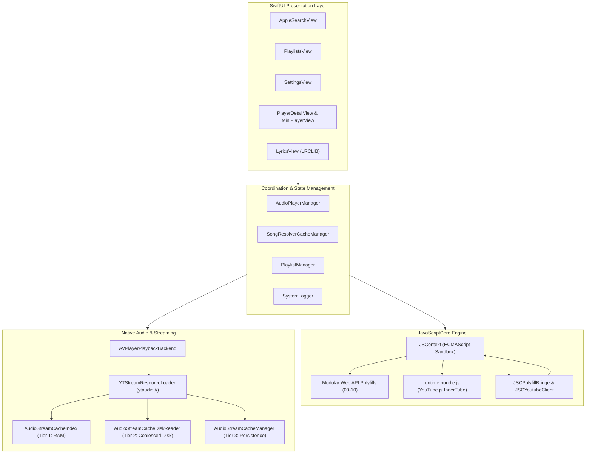

# 🏛️ System Architecture

YTJSMusic implements a decoupled, multi-layered architecture designed to run **YouTube.js** directly inside an isolated iOS JavaScriptCore environment while executing native Swift audio streaming.

---

## High-Level Architecture Diagram



---

## 1. JavaScriptCore Engine & Runtime Bundle

iOS `JavaScriptCore` (JSC) provides a fast, lightweight ECMAScript execution environment without the memory overhead, DOM layout tree, or battery drain of a `WKWebView`.

### Initialization Lifecycle:
1. `JSCYoutubeClient` instantiates a bare `JSContext`.
2. Registers native Swift function pointers into the global scope:
   - `__nativeFetch`: Native HTTP networking via `URLSession`.
   - `__nativeGetRandomValues`: Cryptographically secure random byte generation via `SecRandomCopyBytes`.
   - `__nativeCryptoDigest`: SHA-1/SHA-256 hashing via Swift `CryptoKit`.
   - `__nativeSetTimeout` / `__nativeClearTimeout`: Asynchronous timer management via `DispatchQueue`.
   - `__nativeLog`: Log message forwarding to `SystemLogger`.
3. Loads and evaluates the 11 polyfill files in strict numerical order (`polyfills/00-console.js` $\dots$ `polyfills/10-streams.js`).
4. Evaluates `runtime.bundle.js` (a standalone IIFE bundle of `youtubei.js` generated with esbuild).
5. Initializes the `Innertube` instance:
   ```javascript
   const yt = await Innertube.create({
     client_type: ClientType.IOS,
     retrieve_player: true
   });
   ```

---

## 2. Modular Web API Polyfill Subsystem

Because bare `JSContext` does not provide Web or Node.js APIs, YTJSMusic provides full compliance via native Swift-backed polyfills:

| Polyfill Script | Standard Implemented | Implementation Strategy |
| :--- | :--- | :--- |
| `00-console.js` | WHATWG Console Standard | Bridges `console.log`, `info`, `warn`, `error` to Swift `SystemLogger`. |
| `01-events.js` | DOM Event Standard | Lightweight in-memory `EventTarget`, `Event`, `CustomEvent`. |
| `02-text-encoding.js` | Encoding Standard | Pure JavaScript UTF-8 / ASCII `TextEncoder` & `TextDecoder`. |
| `03-base64.js` | HTML Living Standard | RFC 4648 `atob()` and `btoa()` encoding/decoding. |
| `04-url.js` | WHATWG URL Standard | RFC 3986 compliant `URL` and `URLSearchParams`. |
| `05-fetch.js` | WHATWG Fetch Standard | Full `fetch()`, `Headers`, `Request`, and `Response` implementation bridged to native `URLSession` data tasks. |
| `06-crypto.js` | Web Cryptography API | `crypto.getRandomValues()` (`SecRandomCopyBytes`), `crypto.subtle.digest` (`CryptoKit.SHA256`). |
| `07-timers.js` | HTML Timers Standard | `setTimeout`, `clearTimeout`, `setInterval`, `clearInterval` scheduled across Grand Central Dispatch. |
| `08-performance.js` | High Resolution Time | `performance.now()` utilizing `CACurrentMediaTime()`. |
| `09-abort.js` | DOM Abort Standard | `AbortController` and `AbortSignal` for request cancellation. |
| `10-streams.js` | WHATWG Streams Standard | Full `ReadableStream`, `WritableStream`, and `TransformStream` implementation. |

---

## 3. Decoupled Audio Backend Abstraction

YTJSMusic decouples playback logic from the underlying audio decoding framework via the `AudioPlaybackBackend` protocol:

```swift
public protocol AudioPlaybackBackend: AnyObject {
    var capabilities: AudioPlaybackCapabilities { get }
    func prepare(source: StreamSource, track: Track, resumeTime: Double?)
    func play()
    func pause()
    func seek(to seconds: Double, completion: @escaping (Bool) -> Void)
    func stop()
}
```

### Current & Future Backends:
- **`AVPlayerPlaybackBackend` (Active)**:
  - Uses Apple's hardware-accelerated `AVPlayer` and `AVAssetResourceLoader`.
  - Native support for AAC (`audio/mp4` / `m4a` / itag 140).
  - Minimal CPU usage and zero battery drain.
- **Future Native Opus/FFmpeg Backend**:
  - `AudioPlaybackCapabilities` provides preference ordering (`aac`, `opus`).
  - Seamlessly enables high-bitrate Opus (`audio/webm` / itag 251) decoding without altering the UI or player manager.

---

## 4. Concurrency & Threading Model

- **Main Thread (`@MainActor` / `DispatchQueue.main`)**: SwiftUI views, UI animations, slider tracking, and now-playing metadata publishing.
- **JavaScriptCore Queue (`DispatchQueue(label: "com.ytjsmusic.jsc")`)**: Serial execution queue dedicated to InnerTube JavaScript evaluation to prevent blocking UI interactions.
- **Resource Loader Queue (`DispatchQueue(label: "com.ytjsmusic.resourceloader")`)**: Dedicated queue handling `AVAssetResourceLoadingRequest` chunk dispatching.
- **Disk Reader Queue (`DispatchQueue(label: "com.ytjsmusic.diskreader")`)**: Serial queue for thread-safe synchronous cache manifest reads and block coalescing.
- **Cache Persistence Queue (`Task { await ... }`)**: Actor-isolated disk I/O in `AudioStreamCacheManager` ensuring non-blocking background stream persistence.
