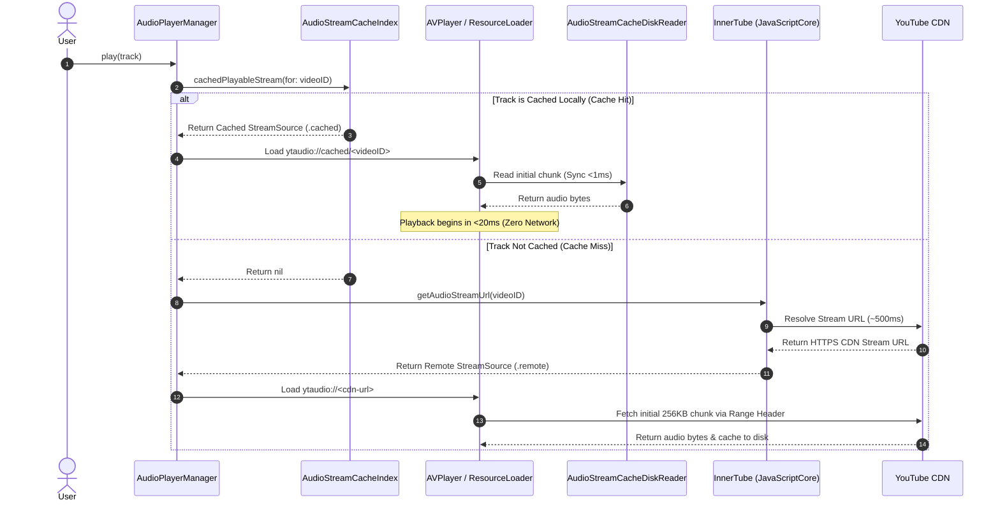

# ⚡ Caching & Streaming Engine

YTJSMusic features an advanced audio streaming and multi-tiered caching architecture built to satisfy YouTube's strict CDN constraints while delivering sub-20ms instant local playback.

---

## 1. Zero-Network Resolution Cache Bypass

When a user taps to play a song, standard third-party players initiate an HTTP round-trip to resolve the audio stream URL from the provider API (taking ~500ms–800ms).

YTJSMusic completely eliminates this delay for cached tracks:



---

## 2. 3-Tier Cache Architecture

```
┌─────────────────────────────────────────────────────────┐
│ Tier 1: In-Memory Index (AudioStreamCacheIndex)          │
│ • Synchronous, lock-protected manifest lookup (<0.1ms)   │
│ • In-memory map of videoID -> [CachedStreamInfo]         │
└────────────────────────────┬────────────────────────────┘
                             │
┌────────────────────────────▼────────────────────────────┐
│ Tier 2: Coalesced Disk Reader (AudioStreamCacheDiskReader)│
│ • Dedicated serial queue reader for AVAssetResourceLoader│
│ • Zero-stall block reading & continuous range assembly   │
└────────────────────────────┬────────────────────────────┘
                             │
┌────────────────────────────▼────────────────────────────┐
│ Tier 3: Async Persistence (AudioStreamCacheManager)      │
│ • Actor-isolated background chunk persistence            │
│ • File layout: Library/Caches/AudioStreams/<videoID>/    │
│   ├── meta.json (Content-Length, MIME, itag, timestamps) │
│   └── 00000000-00040000.chunk                            │
└─────────────────────────────────────────────────────────┘
```

### Directory Structure on Disk:
```
Library/Caches/AudioStreams/
├── dQw4w9WgXcQ_140/
│   ├── manifest.json            # Stream metadata (length: 3518290, mime: audio/mp4)
│   ├── 00000000-00040000.chunk  # Byte range 0 - 262143 (Initial headers + moov/mdat)
│   ├── 00040000-00080000.chunk  # Byte range 262144 - 524287
│   └── ...
```

---

## 3. Custom Stream Loader (`YTStreamResourceLoader`)

YouTube CDN endpoints (`googlevideo.com`) enforce anti-hotlinking and rate-limiting rules:
1. **Mandatory Range Header**: Direct non-ranged requests fail with `HTTP 403 Forbidden` on playback URLs bearing `rqh=1`.
2. **Adaptive Sub-Chunking**: Requests are partitioned into **256KB sub-chunks** to ensure rapid time-to-first-byte and avoid CDN throttling.
3. **Automatic HTTP 403 URL Signature Renewal**: If a temporary CDN token expires mid-stream, `YTStreamResourceLoader` automatically re-resolves a fresh URL signature and transparently retries the chunk.
4. **Exponential Backoff**: Transient network timeouts back off with jitter up to 3 retries.
5. **UTI Mapping**: Dynamically injects `com.apple.m4a-audio` to content information requests, allowing AVPlayer's native hardware decoder to process chunks immediately.

---

## 4. Playback Startup Latency Profiling (`PlaybackStartupTrace`)

YTJSMusic tracks high-precision microsecond timestamps using `CACurrentMediaTime()` to measure and optimize every step of playback startup:

| Timestamp Marker | Metric Description | Cache Hit Target | Remote CDN Target |
| :--- | :--- | :--- | :--- |
| **$t_0$** | User tap event recorded in UI | $0.0\text{ ms}$ | $0.0\text{ ms}$ |
| **$t_1$** | `playQueue` / `loadAndPlayCurrentTrack` invoked | $<1.0\text{ ms}$ | $<1.0\text{ ms}$ |
| **$t_2$** | Cache index lookup completed | $<0.1\text{ ms}$ | $<0.1\text{ ms}$ |
| **$t_3$** | `AVPlayerItem` & `AVURLAsset` instantiated | $<5.0\text{ ms}$ | $<5.0\text{ ms}$ |
| **$t_4$** | ResourceLoader receives first loading request | $<8.0\text{ ms}$ | $<8.0\text{ ms}$ |
| **$t_5$** | First audio bytes supplied to `AVPlayer` | **$<15.0\text{ ms}$** | $\sim 550.0\text{ ms}$ |
| **$t_6$** | `AVPlayerItem.status` transitions to `.readyToPlay` | **$<20.0\text{ ms}$** | $\sim 600.0\text{ ms}$ |
| **$t_7$** | Audio rendering starts through hardware speakers | **$<25.0\text{ ms}$** | $\sim 650.0\text{ ms}$ |

---

## 5. Smart Multi-Level Duration Prefetcher

To deliver true gapless playback transitions, `AudioPlayerManager` dynamically inspects the upcoming queue and remaining song duration:

```swift
let remainingSeconds = duration - currentTime
let threshold: Double = duration < 180 ? 20 : (duration < 480 ? 30 : 45)

if remainingSeconds <= threshold && !hasPrefetchedNextTrack {
    prefetchNextTrack(nextTrack)
}
```

### Prefetch Pipeline:
1. **Level 1 (Song Resolution)**: Resolves the Apple Music track to its YouTube video ID via `SongResolverCacheManager`.
2. **Level 2 (Audio Buffer Warm-Up)**: Resolves the CDN URL and downloads the initial 512KB of audio into `AudioStreamCacheManager`.
3. When the user reaches the end of the song or taps next, the track starts playing **instantly** without buffering!
