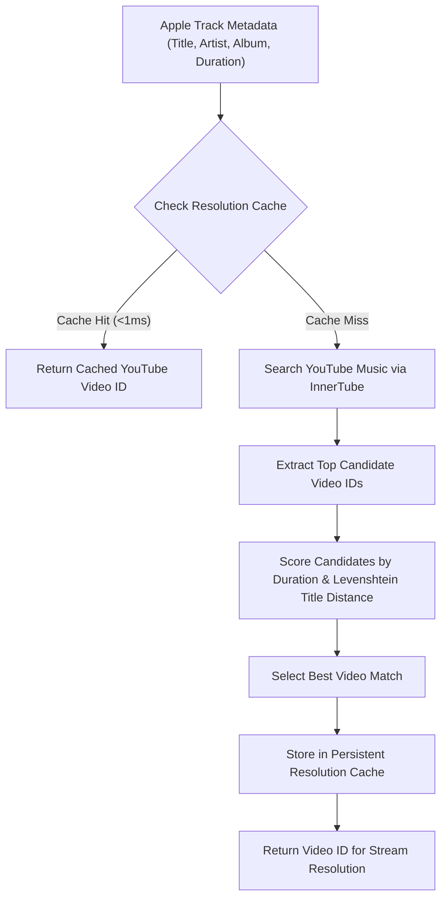

# ✨ Feature Guide

YTJSMusic unites catalog exploration, intelligent stream matching, live synchronized lyrics, and seamless audio playback into a unified, privacy-friendly native iOS app.

---

## 1. Apple Music Catalog Search & Discovery

YTJSMusic queries the iTunes/Apple Music Storefront Search API, giving users complete access to Apple's catalog without needing an Apple Music subscription.

```
┌─────────────────────────────────────────────────────────┐
│  Search: "Daft Punk"                                [X] │
├─────────────────────────────────────────────────────────┤
│  [Top Results]  [Songs]  [Albums]  [Artists]            │
├─────────────────────────────────────────────────────────┤
│  🎵 Get Lucky                                           │
│     Daft Punk • Random Access Memories          4:08    │
│                                                         │
│  🎵 One More Time                                       │
│     Daft Punk • Discovery                       5:20    │
│                                                         │
│  💿 Random Access Memories                              │
│     Daft Punk • 2013 • 13 Songs                         │
└─────────────────────────────────────────────────────────┘
```

### Key Capabilities:
- **Live Autocomplete**: Suggestions populate dynamically with a 300ms debounce as the user types.
- **Category Filter Chips**: Filter instant results into:
  - `Top Results`: Blended view with top hits across songs, albums, and artists.
  - `Songs`: Comprehensive list of individual tracks with explicit badges and durations.
  - `Albums`: Full albums with artwork, release year, and track counts.
  - `Artists`: Complete artist cards linking to full discographies.
- **Fresh Tab Reset**: Tapping "Cancel" or clearing the search box clears active queries, suggestions, and loaded results, returning to the clean catalog discovery state.

---

## 2. Album & Artist Discography Views

- **Album Detail View (`AppleAlbumDetailView.swift`)**:
  - High-resolution album cover artwork with subtle drop shadows.
  - One-tap **Play Album** (starts sequential playback from track 1) and **Shuffle Play** (randomizes the album into the queue).
  - Explicit content indicators (`[E]` badge).
  - In-row 3-dots action menu on every track to play immediately or add to any local playlist.
- **Artist Detail View (`AppleArtistDetailView.swift`)**:
  - Artist profile header with genre classification.
  - Chronological release listing and discography navigation.

---

## 3. Intelligent Song Matching Engine (`SongResolverCacheManager`)

When a user taps an Apple Music track, YTJSMusic dynamically resolves the optimal YouTube Music audio stream:



### Matching Heuristics:
1. **Duration Penalty Filter**: Candidates differing by more than 15 seconds from the catalog duration receive heavy penalties (filtering out live bootlegs, music video skits, and 10-hour extended loops).
2. **Title & Artist Normalization**: Strips casing, punctuation, and extra tags (`(Official Audio)`, `[HD]`, `feat. ...`).
3. **Concurrency Deduplication (`ResolverCoordinator`)**: If multiple prefetch or UI actions request the same track simultaneously, only a single in-flight resolution task executes.

---

## 4. Synchronized Karaoke Lyrics (`LyricsView`, `LrclibService`)

YTJSMusic integrates with the **LRCLIB** database to provide real-time, time-coded lyrics synchronized with audio playback:

- **Karaoke Highlight Animation**: The active lyric line scales smoothly, increases in opacity, and changes color in lockstep with the song's current timestamp.
- **Automatic Centered Autoscrolling**: `ScrollViewReader` smoothly scrolls the active lyric into the center viewport as playback progresses.
- **Interactive Seek-by-Tapping**: Tapping any past or future lyric line instantly seeks audio playback to that exact timestamp.
- **Instrumental Break Detection**: When gaps exceed 8 seconds between lyric timestamps, an animated musical note indicator `🎵 ...` informs the listener of an instrumental passage.
- **Plain Lyrics Fallback**: If time-coded LRC timestamps are unavailable, clean formatted plain lyrics are rendered automatically.

---

## 5. Queue & Local Playlist Management

### Queue View (`QueueView.swift`):
- Displays the currently playing track along with all upcoming tracks.
- **Reordering**: Native SwiftUI drag-and-drop handles to reorder upcoming songs on the fly.
- **Swipe to Remove**: Quick deletion of upcoming songs.
- **Clear Queue**: Reset upcoming queue with one tap.

### Local Playlists (`PlaylistsView.swift`):
- Create unlimited custom local playlists stored persistently on device via `UserDefaults` JSON encoding.
- Add tracks directly from search results, album track lists, or the now-playing 3-dots action menu.
- Shuffle play entire playlists with automatic queue construction.

---

## 6. Now Playing & Mini-Player UI

- **Full-Screen Player Detail (`PlayerDetailView.swift`)**:
  - Full-width high-res album artwork with dynamic scaling.
  - Interactive scrubbable time slider with elapsed and remaining time readouts.
  - Play/Pause, Skip Next, Skip Previous, Shuffle, and Repeat (Off / All / One) controls.
  - Ellipsis Action Menu:
    - *Play Next*: Places track directly after current song.
    - *Add to Queue*: Appends track to the end of the queue.
    - *Add to Playlist*: Opens interactive playlist picker sheet.
    - *Share Song*: Shares YouTube web URL via native `UIActivityViewController`.
- **Floating Mini-Player (`MiniPlayerView.swift`)**:
  - Persistent bottom bar visible across all navigation tabs.
  - Displays thumbnail, title, artist, and inline play/pause toggle.
  - Tap expands into full-screen player view.
  - Proper `safeAreaInset` integration ensures lists and scroll views scroll completely above the mini-player without obscuring content or altering background colors.

---

## 7. Lock Screen, Control Center & CarPlay Integration

- **`MPNowPlayingInfoCenter`**:
  - Real-time elapsed time, playback rate, and track duration synchronization.
  - Asynchronously downloads and caches high-resolution album artwork, rendering sharp visuals on the iOS Lock Screen, Apple Watch, and Control Center via `MPMediaItemArtwork`.
- **`MPRemoteCommandCenter`**:
  - Native hardware and Bluetooth control handling for Play, Pause, Toggle, Next Track, Previous Track, and Change Playback Position (seeking).

---

## 8. Settings & Live In-App Diagnostics

- **Storage & Cache Analytics**: Live display of disk cache size (in MB/GB), total cached stream representations, and cache hit ratio percentage.
- **One-Tap Cache Clear**: Reclaims disk space instantly while safely invalidating in-memory indexes.
- **Passive Health Diagnostics**: Non-intrusive monitoring of buffer state and playback health.
- **Live Terminal Log Viewer (`FullDiagnosticsLogView`)**:
  - Searchable real-time log drawer capturing JSContext operations, InnerTube API requests, and streaming events.
  - One-tap "Copy Full Logs to Clipboard" button for quick troubleshooting.
